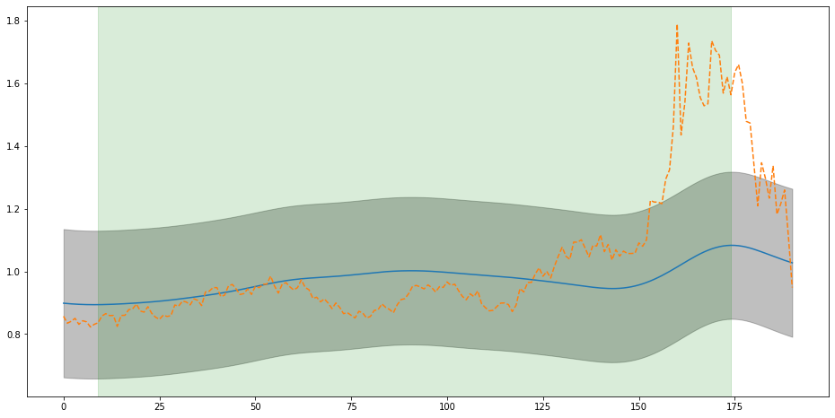
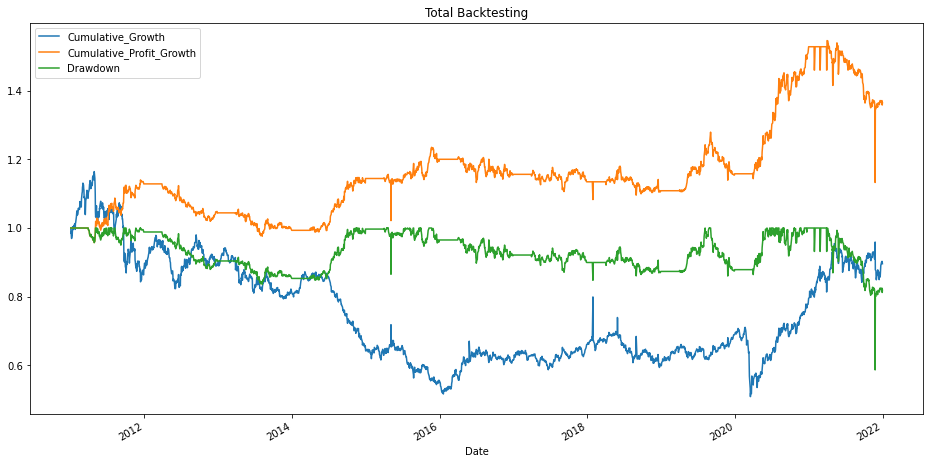

# Procesos Gausianos con aplicaciones en inversiones (Commodity market)
En este trabajo se ha desarrollado una estrategia para operar en tiempo real en el mercado de materias primas. Se estudian condiciones y tendencias pasadas conjuntas del mercado para tomar decisiones previamente programadas, fundamentadas en los Procesos Gaussianos.

Mediante un kernel diseñado específicamente para el problema de predicción que planteamos, al final del primer trimestre del año obtenemos la predicción de cada materia prima en el mercado y calculamos el momento óptimo de entrada y salida en base a una función de coste diseñada que tiene en cuenta el potencial rendimiento de la operación conjuntamente con su potencial riesgo.

Finalmente se estudian los resultados que se hubiesen obtenido al operar conjuntamente en el mercado de materias primas desde el año 2011 hasta el 2021 (ambos incluidos) con dicha estrategia.


## Autores:

- Marcos Cobo Carrillo
- Steven Johan Maria Van Vaerenbergh

## Bibliotecas utilizadas:

En este trabajo usaremos Python (versión 3.7) y diferentes bibliotecas, entre las que destacan:

- GPy
- NumPy
- Pandas
- SciPy
- Scikit-learn
- Matplotlib

Recomendamos no usar una versión de Python superior a 3.7, puesto que no ha sido testeada en este proyecto. Para la instalación de todas las bibliotecas empleadas recomendamos hacerlo desde el fichero requirements.txt escribiendo el siguiente comando en la consola:

```
pip install -r requirements.txt
```
